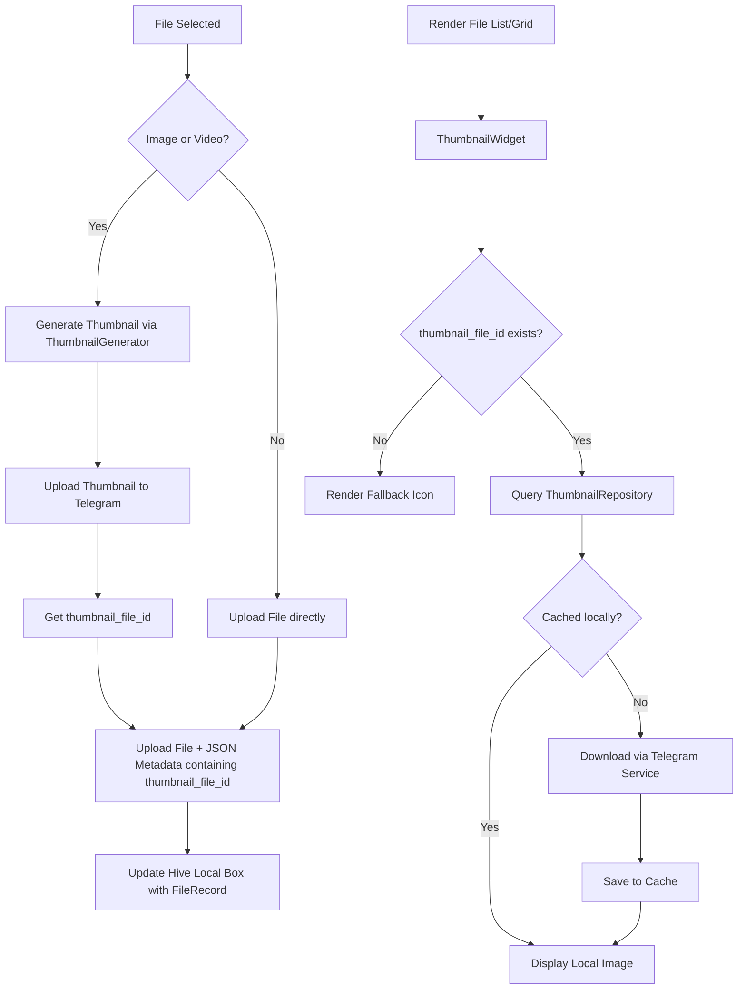

# Design Spec: Image and Video Thumbnails for Android and Web

This specification outlines the architecture, database schema, and implementation plan for generating, uploading, caching, and displaying image and video thumbnails in TelStorage.

---

## 1. Goal Description
To enhance the file browsing experience by showing visual previews of images and videos. The feature must:
1. Generate thumbnails on the client side *before* uploading the main file or its chunks.
2. Upload the thumbnail to Telegram and store its reference (`file_id`) in the file's metadata JSON.
3. Cache thumbnails locally on the device (in-memory for Web, and in the temporary directory for Android) to prevent redundant network calls.
4. Support both Android and Web platforms without compilation or runtime failures.
5. Fail gracefully: if a thumbnail cannot be generated (unsupported codec, corrupt file, etc.), the main file upload should still succeed without a thumbnail.

---

## 2. Technical Architecture & Component Flow



---

## 3. Detailed Proposed Changes

### 3.1 Model & Storage Changes

#### [MODIFY] [file_record.dart](file:///c:/Users/umair-dell/StudioProjects/telstorage/lib/core/models/file_record.dart)
Add `thumbnailFileId` to the local cache database schema under `@HiveField(10)`.
```dart
@HiveType(typeId: 0)
class FileRecord extends HiveObject {
  // ... existing fields ...

  @HiveField(10)
  String? thumbnailFileId;

  FileRecord({
    // ... existing ...
    this.thumbnailFileId,
  });

  factory FileRecord.fromMap(Map<String, dynamic> map) {
    return FileRecord(
      // ... existing ...
      thumbnailFileId: map['thumbnail_file_id'] as String?,
    );
  }
}
```
*Note: Run `dart run build_runner build --delete-conflicting-outputs` to rebuild the adapter.*

---

### 3.2 Services & Repositories

#### [NEW] [thumbnail_repository.dart](file:///c:/Users/umair-dell/StudioProjects/telstorage/lib/core/services/thumbnail_repository.dart)
A local-first caching repository to handle retrieving, downloading, and storing thumbnails.
*   **Android:** Caches files in the OS-provided temporary directory under `/thumbnails`.
*   **Web:** Caches file bytes in-memory (`Map<String, Uint8List>`).
*   **Request Deduplication:** Keeps track of active downloads to prevent fetching the same thumbnail multiple times simultaneously.

#### [MODIFY] [service_locator.dart](file:///c:/Users/umair-dell/StudioProjects/telstorage/lib/core/services/service_locator.dart)
*   Register `ThumbnailRepository` as a dependency.
*   Instantiate `ThumbnailRepository` inside `_doInit()`.

#### [MODIFY] [upload_service.dart](file:///c:/Users/umair-dell/StudioProjects/telstorage/lib/core/services/upload_service.dart)
Update the `uploadFile` pipeline to:
1. Check if the file is an image or video based on mimeType.
2. Call `ThumbnailGenerator` within a `try-catch` block.
3. If successful, upload the thumbnail bytes to Telegram:
   ```dart
   final result = await _telegram.uploadBytesWithFileId(thumbBytes, 'thumb_$fileId.jpg');
   final thumbnailFileId = result['file_id'];
   ```
4. Save the `thumbnail_file_id` inside the per-file metadata JSON under `'thumbnail_file_id'`.

---

### 3.3 Utilities

#### [NEW] [thumbnail_generator.dart](file:///c:/Users/umair-dell/StudioProjects/telstorage/lib/core/utils/thumbnail_generator.dart)
Handles cross-platform thumbnail extraction:
*   **Images:** Uses Flutter's native `ui.instantiateImageCodec(bytes, targetWidth: 150)` to decode and scale down to 150px.
*   **Videos:** Invokes `get_thumbnail_video` package's `VideoThumbnail.thumbnailData`.
*   Uses a conditional helper to prepare the source paths for video extraction.

#### [NEW] [thumbnail_helper_native.dart](file:///c:/Users/umair-dell/StudioProjects/telstorage/lib/core/utils/thumbnail_helper_native.dart)
Native implementation for Android:
*   Writes picked in-memory bytes to a temporary file.
*   Deletes the temporary file in the cleanup phase to prevent leaks.

#### [NEW] [thumbnail_helper_web.dart](file:///c:/Users/umair-dell/StudioProjects/telstorage/lib/core/utils/thumbnail_helper_web.dart)
Web implementation for Chrome:
*   Converts picked bytes into a browser Object URL (`html.Url.createObjectUrlFromBlob`).
*   Revokes the Object URL in the cleanup phase to prevent memory leaks.

---

### 3.4 UI & Presentation

#### [NEW] [thumbnail_widget.dart](file:///c:/Users/umair-dell/StudioProjects/telstorage/lib/shared/widgets/thumbnail_widget.dart)
A reusable widget displaying thumbnails with:
*   A loading indicator while downloading.
*   A graceful fallback to standard mime-type file icons in case of error or if the file does not have a thumbnail.

#### [MODIFY] [browser_screen.dart](file:///c:/Users/umair-dell/StudioProjects/telstorage/lib/features/browser/screens/browser_screen.dart)
*   **List View:** Replace the leading `Container` inside `_FileTile` with a 42x42 `ThumbnailWidget`.
*   **Grid View:** Replace the centered `Icon` inside `_GridFileItem` with a full-size `ThumbnailWidget`.

---

## 4. Verification Plan

### Manual Verification
1.  **Image Uploads (Web & Android):** Pick an image (PNG/JPG) and upload it. Verify that the grid/list views render the thumbnail preview.
2.  **Video Uploads (Web & Android):** Pick a video (MP4/MKV) and upload it. Verify that a video frame from 1s is extracted and displayed as the thumbnail.
3.  **Error Recovery:** Try uploading a corrupt or unsupported file format. Confirm that the file uploads successfully and falls back to a generic file icon.
4.  **Offline Cache:** Load the list with network enabled, switch the device to airplane mode, and verify that the thumbnails remain cached and visible when scrolling.
5.  **Memory Cleanups:** Monitor the temporary directories on Android and browser blob registrations on Web to ensure the temp videos are cleared immediately after extraction.
